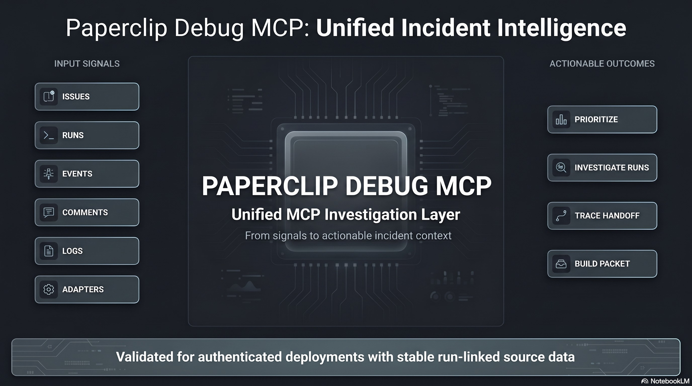

# Paperclip Debug MCP

Paperclip Debug MCP is an MCP-first incident investigation layer for Paperclip-based agent systems.

It gives operators and coding agents one queryable MCP surface for issue triage, run-aware investigation, service context, and handoff evidence - without jumping across disconnected logs, issue threads, and infrastructure tools.

<p align="center">
  
</p>

## Quick Demo

Terminal loop preview (good for README/social snippets):

<p align="center">
  
</p>

## Why it matters

When incidents are investigated with fragmented tools, teams lose time rebuilding context instead of moving toward root-cause.

Paperclip Debug MCP reduces that context fragmentation by exposing one structured investigation surface for:

- issue-centric triage
- run-aware investigation
- handoff tracing
- evidence packet generation

Observed impact from internal tests (directional ranges, not guarantees):

- Time to first root-cause hypothesis: `-40% to -85%`
- Debug loops per incident: `-30% to -70%`
- Tokens per resolved incident: `-25% to -65%`
- Time to build evidence packet: `-60% to -95%`

## What this project is

Paperclip Debug MCP is an investigation backend for operators and coding agents.

It combines:

- collector-backed runtime signals
- incident normalization and analysis
- investigation tools for runs, issues, services, and adapters
- evidence packet construction for escalation and handoff

## What this project is not

This repository is not:

- a replacement for a full observability platform
- a dashboard/UI product in this repository
- a non-MCP primary interface
- a broad workflow automation platform

## What you get

- Faster incident triage and prioritization
- Incident clustering by fingerprint and trend analysis
- Unified queries for runs, events, issues, comments, services, and logs
- Run-level handoff tracing for investigation continuity
- Incident packet generation for handoff and audit workflows
- Redaction of token-like secrets in returned excerpts

## Public beta scope

This project is currently in active beta.

Validated as usable now in the current public-beta posture:

- issue-centric investigation (`list_issues`, `get_issue_comments`, prioritization, packet flow with run context when linked data exists)
- run-aware investigation (`list_runs`, `get_run_events`, `trace_handoff`) in validated authenticated deployment profiles
- one MCP surface for issue, run, event, service, and handoff workflows

This beta is best suited for authenticated Paperclip deployments where source APIs emit stable run-linked transition data and issue payloads expose stable run linkage aliases.

## Important beta caveat

Run-aware behavior remains deployment-data dependent.

Public beta messaging should be read as:

- validated in authenticated deployments matching this profile
- not a universal-compatibility claim across all deployment shapes
- not a statement that all optional adapters are broadly validated yet

## Current coverage

Current coverage includes:

- Paperclip API
- Docker
- host file logs
- optional health adapters for WordPress, Caddy, Sentry, Kubernetes, PostgreSQL, and Redis

Optional adapters are available, but they are not yet broadly validated as part of the current public-beta decision surface.

## Quick links

For current beta posture and launch details, see:

- `docs/public-beta-readiness-report.md`
- `docs/run-aware-public-beta-decision.md`
- `docs/public-beta-announcement-draft.md`
- `docs/public-beta-adopter-notes.md`
- `docs/release-readiness-checklist.md`

## Quick Start

```bash
npm install
cp .env.example .env
npm run doctor
npm run smoke:live
npm run mcp:stdio
# or
npm run mcp:http
```

Optional incident packet export:

```bash
npm run incident:packet -- --issue-id <issue-id>
# or
npm run incident:packet -- --run-id <run-id>
```

Configuration is environment-driven via `.env` (see `.env.example`). Key settings include `PAPERCLIP_BASE_URL`, `PAPERCLIP_TOKEN`, `PAPERCLIP_COMPANY_ID`, collector enable flags, and HTTP transport options.
For authenticated deployments, use the Paperclip quick-check subsection in `docs/getting-started.md` before relying on run/issue tools.

## Documentation

- [Getting Started](docs/getting-started.md): first-run setup and initial validation flow.
- [Configuration](docs/configuration.md): environment variable reference and adapter configuration behavior.
- [MCP Tools Reference](docs/mcp-tools-reference.md): current tool contracts and output-shape notes.
- [MCP Playbook](docs/mcp-playbook.md): ready-to-run diagnostic call sequences.
- [Runtime Profiles](docs/runtime-profiles.md): practical `.env` profiles for common runtime stacks.
- [Collector Adapter Guide](docs/collector-adapter-guide.md): how to add and register new adapters.
- [Release Readiness Checklist](docs/release-readiness-checklist.md): lightweight public-beta release validation.
- [Public Beta Readiness Report](docs/public-beta-readiness-report.md): latest release-candidate validation decision memo.
- [Run-Aware Public Beta Decision](docs/run-aware-public-beta-decision.md): current safe public-beta scope and deployment conditions.
- [Issue-Centric Public Beta Decision](docs/issue-centric-public-beta-decision.md): historical constrained decision note superseded by run-aware validation.
- [Video Rendering](docs/video-rendering.md): render the short X explainer video with Remotion (local or CI).
- [Social Captions](docs/social-captions.md): ready-to-post text for X and LinkedIn.

## MCP Tools

Core tools:

- `paperclipDebug.get_runtime_config`
- `paperclipDebug.list_collectors`
- `paperclipDebug.refresh_collectors`
- `paperclipDebug.list_incidents`
- `paperclipDebug.list_incident_clusters`
- `paperclipDebug.incident_trends`
- `paperclipDebug.prioritize_incidents`
- `paperclipDebug.trace_handoff`
- `paperclipDebug.list_runs`
- `paperclipDebug.get_run_events`
- `paperclipDebug.list_issues`
- `paperclipDebug.get_issue_comments`
- `paperclipDebug.list_services`
- `paperclipDebug.get_service_logs`
- `paperclipDebug.build_incident_packet`
- `paperclipDebug.system_snapshot`

Optional adapter tools:

- `paperclipDebug.wordpress_health`
- `paperclipDebug.caddy_health`
- `paperclipDebug.sentry_health`
- `paperclipDebug.k8s_health`
- `paperclipDebug.postgres_health`
- `paperclipDebug.redis_health`

## Transports

- `mcp:stdio`: local stdio mode for MCP clients.
- `mcp:http`: streamable HTTP MCP server mode.

HTTP endpoints:

- `POST /mcp`
- `GET /mcp`
- `DELETE /mcp`
- `GET /healthz`

Optional bearer auth is supported via `MCP_HTTP_AUTH_TOKEN`.

## Current Status

This project is in active beta with working collectors and investigation tooling.

Current scope:

- MCP server (`stdio` and `http`)
- Paperclip API collector (issues, comments, runs, events)
- Docker collector (services and logs)
- Filesystem log collector
- Optional ecosystem adapters: WordPress, Caddy, Sentry, Kubernetes, PostgreSQL, Redis
- Incident clustering, trends, prioritization, and handoff trace
- Incident packet builder and CLI export

Current validated public-beta posture:

- Issue-centric scope: validated for authenticated deployment.
- Run-aware scope: validated for authenticated deployment where upstream/source emits run-linked handoff transitions and issue linkage aliases.
- Optional adapters: available, but not broadly validated in this release decision pass.

## Public Beta Surface

- `package.json` remains `private: true` for now to prevent accidental npm publication.
- Version remains `0.1.0` until a dedicated packaging/publication decision is finalized.
- Public-beta readiness is tracked with [docs/release-readiness-checklist.md](docs/release-readiness-checklist.md).

## Development

Quality and build commands:

```bash
npm run check
npm run build
npm run test
```

Operational utility commands:

```bash
npm run doctor
npm run smoke:live
npm run benchmark:report -- --input-dir ./artifacts --output ./artifacts/benchmark.md
npm run collector:new -- --name wordpress --kind external
```

When adding a new optional adapter, update `README.md`, `.env.example`, and `docs/runtime-profiles.md` in the same PR.
